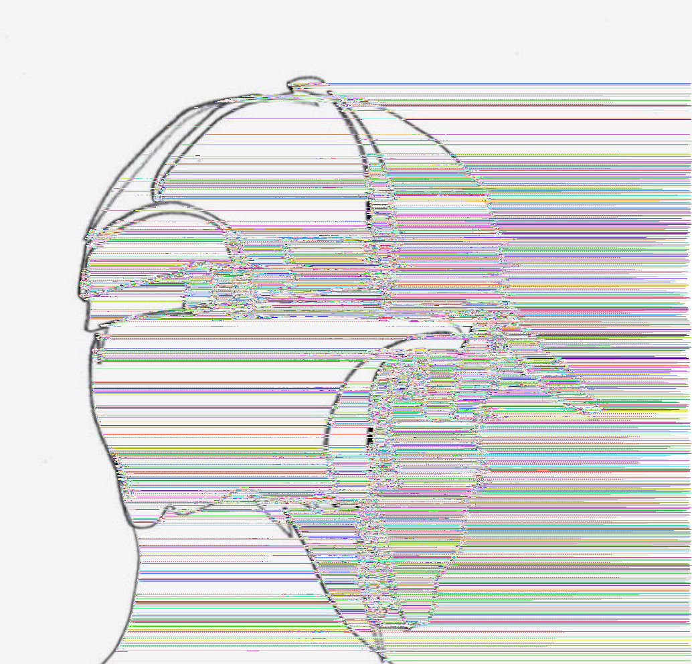
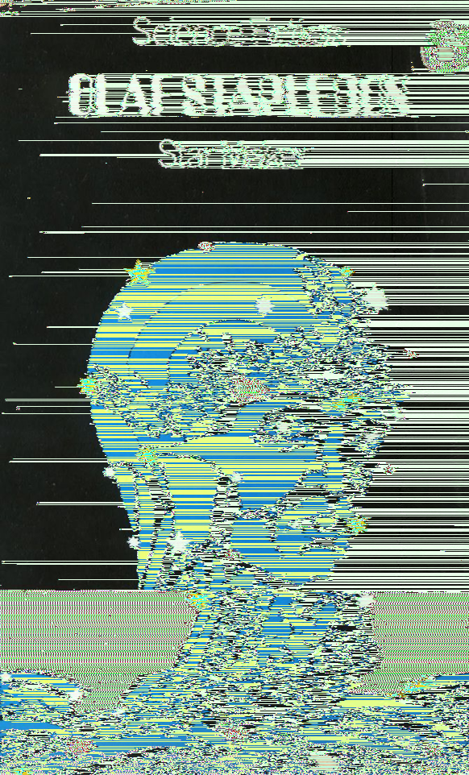
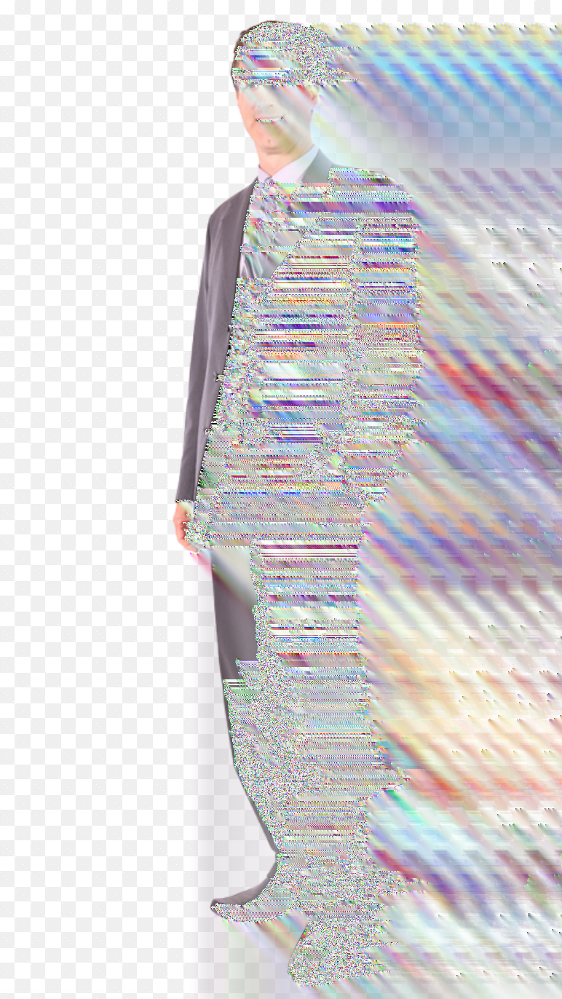
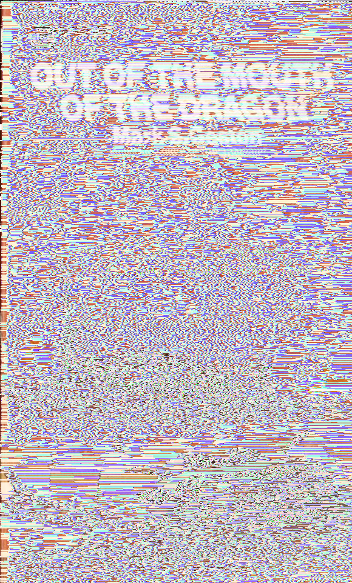
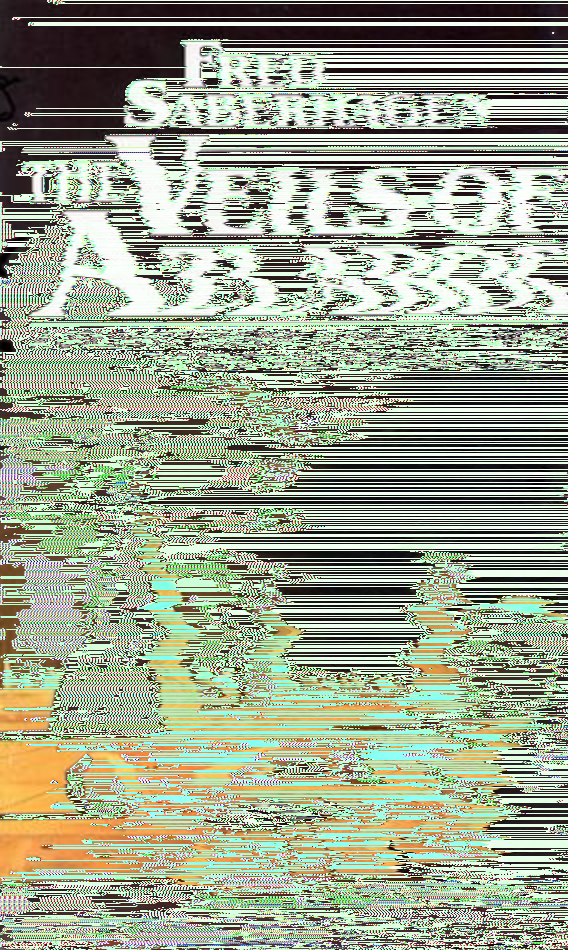

# glitch

## Installation
```
gem install bundler
bundle install
brew install imagemagick
```

### Installing Ruby
Don't use system ruby on OSX because it's hooked into everything.
```
\curl -sSL https://get.rvm.io | bash -s stable --ruby
rvm install 2.7.0
```

## Gallery







